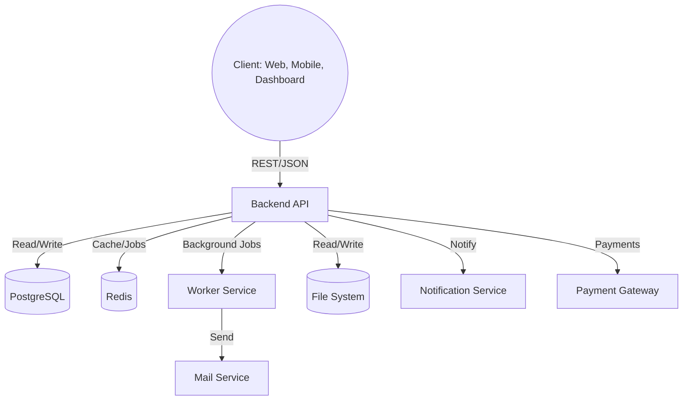

# System Architecture

This document provides a high-level overview of the system architecture, folder structure, data flows, and key design decisions for this repository.

## High-Level Architecture

This repository implements the **Backend API** for Project PH:

- **Backend API (NestJS, Prisma, PostgreSQL, Redis)**: Core business logic, authentication, REST API, background jobs, and integrations.

Other components (web app, dashboard, mobile app) are out of scope for this repository and are handled in separate projects.

### Data Flow Example (Backend API)

## Folder and Module Structure

- `src/`: Main application source code. Contains controllers, services, and modules.
  - `common/`: Common NestJS module for providers, guards, interceptors, and decorators shared across modules.
  - `config/`: Configuration module for environment variables, settings, and configuration providers.
  - `modules/`: Main business modules (feature modules, domain logic).
  - `shared/`: Shared utilities and cross-cutting helpers (not NestJS modules).
  - Unit and integration tests may be co-located with source files.
- `test/`: (Optional) Additional automated tests (e.g., e2e, integration) if not co-located.
- `docs/`: API-specific and specialized documentation for this backend (e.g., API usage, module details, implementation notes).
  - Note: There is also a shared `roobra-docs` repository ([github.com/kelthon/roobra-docs](https://github.com/kelthon/roobra-docs)) for ecosystem-wide and cross-service documentation. Locally it may be checked out as a sibling folder (`../roobra-docs`), but do not assume that path exists — it depends on the workspace setup.

## Key Dependencies and Frameworks

- **NestJS**: Backend framework (modular, scalable).
- **Prisma**: ORM for PostgreSQL.
- **Redis**: Caching, queues, session management.
- **BullMQ**: Background job processing.
- **Docker**: Containerization and orchestration.

## Architectural Principles

- Modular and loosely coupled components.
- Well-defined interfaces and APIs.
- SOLID and DRY principles.
- Stateless services where possible.
- Centralized authentication and authorization.
- Observability (logging, tracing, metrics).

## Extension and Integration Points

- RESTful APIs for service communication.
- External integrations: Payment gateways, notification services, email providers.

## Architectural Decisions

- Use of JWT for stateless authentication.
- Use of Redis for caching and background jobs.
- Use of Docker Compose for local development and orchestration.

For detailed flows and diagrams, see the [architecture/](https://github.com/kelthon/roobra-docs/tree/main/architecture) folder in the `roobra-docs` repository.
