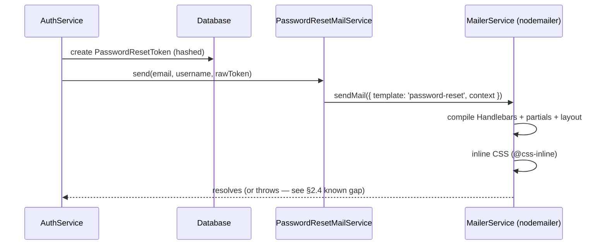

# Notifications Module — Spec & Decisions

**Context:** design discussion for the transactional email capability needed by
password recovery (BR-11) and email verification (BR-12), both P0 per
`roobra-docs` `management/mvp-summary.md`. Captured from the `feat/auth`
branch design session on 2026-09-11.

> ⚠️ **This spec describes the target architecture, not necessarily what is on
> disk right now.** See [§8 Current code vs. this spec](#8-current-code-vs-this-spec)
> before assuming any of this is already implemented — check it again if this
> file is more than a few days old, since `roobra-docs`
> `management/pre-email-integration-checklist.md` went stale within a day of
> being written.

## 1. Scope

The `notifications` module in `roobra-api` (`src/modules/notifications/`) is
responsible for rendering and sending transactional emails. It does not cover
push notifications or WhatsApp (separate `WHATSAPP_*` env vars already exist
for that, unrelated effort) — "Notificações & Jobs em background" in the
roadmap is broader than this module.

## 2. Decisions

### 2.1 Sending library: `@nestjs-modules/mailer`

**Decided:** use `@nestjs-modules/mailer` (built on nodemailer) instead of a
hand-rolled abstraction.

**Alternatives considered:**

- A custom `MailProvider` interface + own nodemailer wiring, built and
  discarded during this session (see §8). Rejected because it reimplements
  things the library already gives for free: CSS inlining
  (`@css-inline/css-inline`), a dev-mode browser preview
  (`preview: true`), boot-time SMTP credential verification
  (`verifyTransporters: true`), and Handlebars/EJS/Pug/Liquid/MJML adapters.
  All its extra peer deps (`mjml`, `ejs`, `pug`, `liquidjs`, `bullmq`,
  `@nestjs/terminus`, ...) are `optional` in `peerDependenciesMeta`, so only
  what's actually installed (`handlebars`) gets pulled in — verified against
  the published package, not assumed.
- React Email — rejected for now: brings `react`/`react-dom` into an API
  repo that otherwise has no React, for a benefit (typed props, component
  reuse) that matters more once the email catalog is large. Worth
  revisiting if the catalog grows a lot and the team is fine with JSX in the
  backend.

**Consequence:** the module has no transport-agnostic seam anymore —
`MailerService` (nodemailer-shaped) is the transport layer. This was traded
away knowingly: nodemailer itself talks to SMTP, SES, sendmail, streaming,
etc., so this is a soft cost, not a hard lock-in, except for a pure-HTTP
provider with no SMTP interface.

### 2.2 Template engine: Handlebars (plain, no MJML)

**Decided:** Handlebars, used directly (not wrapped in MJML).

**Alternatives considered** (see full comparison in this session's chat
history if needed):

- **EJS** — rejected: embeds real JS in the template, higher risk of
  business logic leaking into markup vs. Handlebars' logic-less design.
- **Pug** — rejected: indentation syntax means any HTML mockup from a
  designer needs manual translation before it can be dropped in; no
  upside for this team over Handlebars.
- **Liquid** — rejected: the only one of the four with no built-in CSS
  inlining in this library's adapter (verified in `liquid.adapter.js` —
  no `css-inline` import, unlike the other three); its sandboxing benefit
  (safe to render untrusted templates) doesn't apply since only the dev
  team authors templates.
- **Handlebars + MJML** — genuinely solves a real problem (Outlook/old
  clients not supporting modern CSS layout — MJML compiles to
  table-based bulletproof HTML, which is a different problem than the
  plain CSS inlining Handlebars/EJS/Pug already get for free). Deferred,
  not rejected outright: the tag-learning-curve and mockup-to-MJML
  translation cost isn't justified yet. **Revisit if/when an actual
  Outlook-rendering bug report comes in** — swapping is additive (MJML
  wraps whichever sub-engine you already use; no service-layer rewrite
  needed, see the library's `mjml.adapter.js`).

### 2.3 Transport / provider — **not yet decided, intentionally**

**Status: open.** Using generic SMTP (nodemailer's SMTP transport) as a
placeholder — works with Mailtrap/Ethereal locally, and with SES/Postmark's
own SMTP interfaces if kept as-is. `.env.example` already has
`EMAIL_HOST/PORT/USER/PASSWORD/FROM`.

The real choice — SMTP vs. Resend vs. AWS SES (native SDK) vs. Postmark —
was explicitly deferred by the team ("ainda não sei / decidir depois" on
2026-09-11), **not defaulted into silently**. Earlier in this same session an
assumption was made in that direction without asking first; that was called
out and corrected. **Do not assume a provider here again — ask before
implementing against one.** `roobra-docs` `architecture/auth-flow.md` names
"SES/Resend" in its sequence diagram, which is a signal, not a decision.

Revisit before production traffic depends on deliverability (bounce/complaint
handling, DKIM/SPF, IP reputation are not addressed by generic SMTP).

### 2.4 How other modules trigger a send: direct synchronous call

**Decided:** `AuthService` injects `PasswordResetMailService` directly and
`await`s the send inline, inside the same request that creates the
`PasswordResetToken`.

**Alternatives considered:**

- **Domain event** (`@nestjs/event-emitter`) — lower coupling between
  `AuthModule` and `NotificationsModule`, but doesn't fix the resiliency
  gap below by itself.
- **Queue (BullMQ)** — solves both coupling and resiliency (retry,
  dead-letter, survives process crash). Rejected **for now**, not
  forever: `roobra-docs` `management/mvp-summary.md` §2.4 already
  schedules "Notificações & Jobs em background" (BullMQ) for **Sprint 4,
  P1**, depending on Sprint 3 (subscriptions), neither of which exists in
  code yet. Building the queue today would be ahead of the roadmap's own
  sequencing. `REDIS_URL` is already provisioned in `.env.example`, so
  the infra cost to add this later is low when Sprint 4 starts.

**Known, accepted gap:** today, if the SMTP send throws, `forgotPassword()`
surfaces a 500 to the caller even though the `PasswordResetToken` row was
already committed — the two operations aren't atomic. Acceptable at current
volume/stage; if this becomes a real support issue, the fix is either an
event-based fire-and-forget send or (more rigorous) an outbox pattern
(write intent-to-send in the same Prisma transaction as the token, a
separate worker delivers it) — not needed as a day-one requirement.

### 2.5 Locale / i18n template structure: shared `layouts/`/`partials/`, per-locale leaf templates under `templates/locale/<locale>/`

**Decided:** locale-specific content lives only in the leaf use-case
templates, nested under one `locale/` parent folder —
`templates/locale/en/password-reset.hbs`,
`templates/locale/pt-BR/password-reset.hbs`, etc. `templates/layouts/` and
`templates/partials/` stay locale-agnostic and shared across every locale.

**Why not duplicate `layouts/`/`partials/` per locale too:** verified
against the installed `@nestjs-modules/mailer` 2.3.7's `HandlebarsAdapter`
source (`node_modules/@nestjs-modules/mailer/dist/adapters/handlebars.adapter.js`),
not assumed:

- `options.layout` is a single fixed string read once from
  `MailerModule.forRootAsync`'s config — there is no per-`sendMail()`
  override in this version. "One layout per locale" isn't a config this
  library supports; supporting it would mean multiple adapter instances or
  hand-rolled rendering, reimplementing exactly what §2.1 already decided
  not to reimplement.
- Partials are registered once at boot via
  `glob.sync(partials.dir + '/**/*.hbs')`, keyed by the path relative to
  `partials.dir`. A `partials/en/footer.hbs` would register as partial
  `en/footer`, forcing every leaf template to hardcode its own locale in
  each `{{> ...}}` call — no benefit over one shared partial with
  locale-varying text passed through `context`.
- The leaf template path (`mail.data.template`), by contrast, is resolved
  with a plain `path.join(templateBaseDir, path.dirname(template))` — a
  locale segment there (`template: 'locale/en/password-reset'`) needs zero
  library changes.

This mirrors the chrome-vs-content split the marketing-template design
already settled on in §9.6 ("branding shell ... stay in the same
code-owned templates/layouts/ ... only content is DB-driven") — here,
locale is what varies; chrome still doesn't.

**Consequence:** any text that legitimately differs by locale but lives in
the shared layout/partials (footer legal text, e.g.) is passed as a
`context` value per locale (e.g. `footerDisclaimer`) rather than as a
separate partial file. `templates/partials/footer.hbs` already has this
override hook (`{{#if footerDisclaimer}}`).

**Alternatives considered:**

- Locale folders flat under `templates/` (`templates/en/`,
  `templates/pt-BR/`, siblings of `layouts/`/`partials/`) — works
  identically from the library's point of view. Rejected only for
  tidiness: nesting every locale under one `locale/` parent keeps
  `templates/`'s top level to exactly three concerns (`layouts/`,
  `partials/`, `locale/`) instead of growing one entry per language.
- Full per-locale duplication of `layouts/` + `partials/` — rejected, see
  "Why not duplicate" above: unsupported by the library without working
  around it, and would reintroduce the maintenance-drift problem §9.6
  already avoided for marketing templates (a design fix landing in one
  locale's copy and not the others).

### 2.6 Locale source: `User.preferredLang`, seeded once from `Accept-Language` at registration

**Decided:** add a nullable column and seed it opportunistically at signup;
after that it's the single, stable source of truth — no header is read
again on later sends.

```prisma
preferredLang String? @map("preferred_lang") @db.VarChar(5)
```

- `VarChar(5)`, not an enum and not `Char` — same reasoning already used
  for `MarketingEmailTemplate.lang` in §9.4: locale tags (`en`, `pt-BR`)
  are variable length, and a new supported locale should cost a new
  `templates/locale/<tag>/` folder, not a migration to widen an enum.
- Nullable, **no column default**. A `NOT NULL DEFAULT 'en'` would decide
  every existing and future user's language without asking anyone — the
  same silent-default failure mode this doc already rules out for the
  transport decision (§2.3). "No preference captured yet" has to be a real,
  representable state.
- `AuthService.register()` parses the request's `Accept-Language` header at
  signup time, validates the result against the module's supported-locale
  list (see §2.5's `templates/locale/` folders), and stores the match —
  or leaves the column `null` if parsing fails or the browser's language
  isn't one this app ships templates for. This is a **one-time best guess
  at account creation**, not a live per-request lookup: once stored, it's
  what every future transactional email uses, independent of whatever
  `Accept-Language` a later request happens to carry.
- Existing users (created before this ships) stay `null` — no backfill
  migration attempts to guess their language retroactively. Reading a
  `null` `preferredLang` at send time falls back to one fixed default
  locale in code (`DEFAULT_LOCALE`, e.g. `'en'`), the same fallback path
  used for a stored value that no longer matches a supported locale.

**Alternatives considered:**

- **Pure `Accept-Language` per request, no column** — works for
  request-triggered sends (`forgot-password` is a POST, so the header
  exists) but breaks for the Sprint 4 case in §5 (subscription-expiring
  emails fired from a background job with no HTTP request in flight), and
  isn't a stored preference — someone browsing in English but wanting
  Portuguese email has no way to express that. Rejected as the sole
  source, kept only as the one-time seed at registration.
- **`NOT NULL DEFAULT` on the column** — rejected per the bullet above:
  decides for every user silently instead of representing "not captured
  yet" honestly.
- **Separate `UserPreference` table** — rejected as premature: nothing
  else in the schema today models a user preference, so a join on every
  transactional send would pay for a generalization with no second use
  case yet (YAGNI). Revisit if/when more than one user-level preference
  needs modeling.
- **`Json?` preferences blob on `User`** — rejected: trades away Postgres
  typing/constraints for schema-less growth room the codebase doesn't
  need yet, for a value that's read in a hot path (every transactional
  send) and benefits from being a plain, indexable column.

**Consequence / not yet built:** parsing `Accept-Language` and wiring it
into `AuthController`/`AuthService.register()`, and reading
`user.preferredLang` (with the `DEFAULT_LOCALE` fallback) inside
`PasswordResetMailService`/`EmailVerificationMailService`, are **auth- and
registration-side changes**, not part of `NotificationsModule` itself —
tracked as follow-up work, not covered by this module's implementation
plan.

## 3. Target architecture

```txt
src/modules/notifications/
  notifications.module.ts
  services/
    password-reset-mail.service.ts
    email-verification-mail.service.ts
  interfaces/
    password-reset-context.interface.ts
    email-verification-context.interface.ts
  templates/
    layouts/
      main.hbs            → shared branding shell, `{{{body}}}`
    partials/
      footer.hbs
      button.hbs
    locale/               → see §2.5 for why layouts/partials sit outside this
      en/
        password-reset.hbs
        email-verification.hbs
      pt-BR/
        password-reset.hbs
        email-verification.hbs
```

`notifications.module.ts` registers `MailerModule.forRootAsync` with:

- `transport` built from `mail.config.ts` (`EMAIL_HOST/PORT/USER/PASSWORD`)
- `defaults.from` from `mail.config.ts` (`EMAIL_FROM`)
- `template.adapter = new HandlebarsAdapter()`, `template.dir` pointing at
  `templates/`
- `options.partials.dir` pointing at `templates/partials/` (auto-registered
  via glob by the adapter)
- `options.layout = 'layouts/main'`
- `preview: process.env.NODE_ENV !== 'production'` — opens the rendered
  email in a browser tab in dev instead of/alongside sending
- `verifyTransporters: true` — fails fast at boot on bad SMTP creds, instead
  of failing on the first `forgot-password` request

Each use case keeps a small typed wrapper service (e.g.
`PasswordResetMailService.send(to, username, resetToken)`) that builds a
`context` object typed against a dedicated interface (`satisfies
PasswordResetContext`) and calls `MailerService.sendMail({ to, subject,
template, context })`. This is where compile-time type safety is recovered,
since `sendMail`'s own `context` param is `Record<string, any>`.

Config additions used by this module: `src/config/mail.config.ts`
(`mail.host/port/user/password/secure/from`) and `src/config/app.config.ts`
(`app.frontendUrl`, used to build links in emails).

## 4. Flow — password reset



## 5. Per-use-case scope

| Use case | BR | Status |
| --- | --- | --- |
| Password reset | BR-11, P0 | Token generation + persistence already implemented in `auth.service.ts`; wiring to this module's send is the remaining step described in §3 |
| Email verification | BR-12, P0 | Template + wrapper service can be built per §3, but **cannot be wired to any endpoint yet** — there is no `EmailVerificationToken` model (unlike password reset) and no `/verify-email` route. Needs its own migration + endpoint first, reusing `SimpleTokenService`/`SimpleHashService` the same way password reset does. |
| Welcome / receipt / subscription-expiring emails | BR-11, BR-23, P0 (Sprint 4) | Not started — no `Order`/`Subscription` flows exist in code yet to trigger them from |

## 6. Explicitly out of scope right now

- **BullMQ / background worker** — Sprint 4, P1, per roadmap; see §2.4.
- **Outbox pattern** — only worth the complexity if lost/duplicate emails
  become an actual incident, not a day-one default.
- **MJML** — deferred per §2.2, not rejected permanently.
- **React Email** — deferred per §2.1.
- **A specific email provider (Resend/SES/Postmark)** — open per §2.3.
- **Rate limiting specific to email sending** — `/forgot-password` and
  `/reset-password` are already behind `@Throttle` (BR-30 general auth
  rate limiting is implemented, contrary to what `roobra-docs`
  `management/pre-email-integration-checklist.md` says — that doc is
  stale on this point).
- **Content-managed marketing email templates** (DB-backed, editable via a
  future dashboard) — designed but not built, see §9.

## 7. Env vars required

```.env
EMAIL_HOST=
EMAIL_PORT=
EMAIL_USER=
EMAIL_PASSWORD=
EMAIL_FROM=
FRONTEND_URL=
```

All already added to this repo's `.env.example`.

## 8. Current code vs. this spec

As of 2026-09-11, this repo's working tree (uncommitted, on `feat/auth`) has
a **first-pass implementation that predates this spec and does not match
it**: a hand-rolled `MailProvider` interface + `SmtpMailProvider`
(nodemailer, no template engine at all — HTML built via template literals),
wired into `AuthService.forgotPassword()` for real, with passing tests. That
was superseded by the decisions in §2.1/§2.2 above and needs to be migrated
to `@nestjs-modules/mailer` + Handlebars before this spec is accurate. Until
that migration happens, treat this file as the plan, and
`src/modules/notifications/` on disk as the thing being replaced — check
`git log`/`git status` on that path before trusting either this doc or the
code blindly.

## 9. Future: content-managed marketing email templates

**Context:** discussed on 2026-09-12, prompted by a draft
`MarketingEmailTemplate` Prisma model the team sketched while exploring
whether file-based templates (§2.2) would be limiting long-term. **Not
implemented, not migrated** — the model was removed from
`prisma/models/custom.prisma` after this discussion so it doesn't sit as
dead/unmigrated schema in the live codebase. This section is the source of
truth for the idea until someone actually builds it.

### 9.1 The idea

Marketing emails specifically could be authored/edited through a future
admin dashboard and stored in the database, so a non-dev (marketing/content)
role can change copy without a deploy — unlike the file-based templates in
§2.2/§3.

### 9.2 Decision: marketing-only, never auth/transactional

Password reset, email verification, and any future security- or
account-critical email stay file-based and code-reviewed, **forever**, not
just for now. A broken `{{resetUrl}}` in a DB-edited template is a security
incident, not a copy typo. Only promotional/marketing content is a
candidate for DB-backed editing.

### 9.3 Rejected: sharing one model with WhatsApp templates

An earlier draft used a single `NotificationType` enum
(`MARKETING`/`UTILITY`/`AUTHENTICATION`/`SERVICE`) — which is, not by
coincidence, Meta's official WhatsApp Business API template category
taxonomy (`.env.example` already has
`WHATSAPP_API_URL/ACCESS_TOKEN/PHONE_NUMBER_ID`). Whether email and
WhatsApp templates should ever share one model was raised and **not
pursued**: WhatsApp templates need Meta pre-approval, numbered `{{1}}`
placeholders, and separate header/body/footer/button components —
structurally incompatible with a free-text HTML `content` blob. The model
was narrowed to email-only, marketing-only, and renamed
`MarketingEmailTemplate`.

### 9.4 Draft schema (last reviewed 2026-09-12)

```prisma
enum TemplateStatus {
  DRAFT       @map("draft")
  ACTIVE      @map("active")
  DEACTIVATED @map("deactivated")

  @@map("template_statuses")
}

model MarketingEmailTemplate {
  id               String         @id @default(nanoid()) @db.Char(21)
  name             String         @db.VarChar(255)
  lang             String         @db.VarChar(5)
  status           TemplateStatus @default(DRAFT)
  subject          String         @db.VarChar(255)
  content          String         @db.Text
  layout           String         @default("main") @db.VarChar(50)
  previewVariables Json?          @map("preview_variables")

  createdAt DateTime  @default(now()) @map("created_at") @db.Timestamptz
  updatedAt DateTime  @updatedAt @map("updated_at") @db.Timestamptz
  deletedAt DateTime? @map("deleted_at") @db.Timestamptz

  @@unique([name, lang])
  @@map("marketing_email_templates")
}
```

Field notes:

- `id` is nanoid on the PK itself (matches `User`, not `Media`'s BigInt-id +
  `slug` pattern) — this table has no public/SEO URL use case, it's an admin
  resource, closer to `User` than to content models.
- `lang` is `VarChar(5)`, not `Char(5)` — locale tags (`en`, `pt-BR`) are
  variable length; fixed-length `Char` would blank-pad shorter values and
  risk lookup/comparison bugs downstream. `Char` is only correct for
  genuinely fixed-length values like nanoid (see `id`).
- `@@unique([name, lang])`, not `name` alone — lets the same logical
  template exist in multiple languages.
- `layout` defaults to `"main"` and selects among a small set of
  **code-owned** layouts (see §9.6) — it does not let dashboard users edit
  the layout itself.
- `previewVariables` is preview-only tooling for the future dashboard
  (render a form + example values); see §9.5 for what it deliberately does
  not cover.

### 9.5 Known, unresolved gap: no runtime enforcement of variables

`previewVariables` only feeds the dashboard's preview UI — it is not
validated against what the real send actually passes as `context`. If
someone renames `{{username}}` in `content` without updating the code path
that sends the campaign, Handlebars renders the missing key as an empty
string by default, silently, in a real email. Not solved by this model. The
fix belongs in application code, not the schema: compile with
`Handlebars.compile(content, { strict: true })` so a missing key throws
instead of rendering blank, treated as a failed send rather than a silent
one. **Decide this before building the send path, not after.**

### 9.6 Layout/partial reuse: resolved by keeping the chrome in code

Branding shell (header/logo), the shared footer, and — critically — the
unsubscribe link (a compliance requirement, not just a design element) stay
in the same code-owned `templates/layouts/` and `templates/partials/` used
by transactional emails (§3). Only `content` (the body) is DB-driven.
`layout` (§9.4) picks among a small set of pre-approved code layouts; it is
not an arbitrary customization surface. A dashboard user can change what a
campaign says, never the chrome around it.

### 9.7 Implementation cost, not yet paid

`@nestjs-modules/mailer`'s `HandlebarsAdapter` only reads templates from
disk (`fs.readFileSync` + in-memory cache, verified in
`handlebars.adapter.js`). Serving `content` from Postgres instead requires
implementing the library's `TemplateResolver` extension point — a real
piece of code (fetch by `name`+`lang`, compile the raw string, wrap in the
shared layout, cache appropriately since a marketing send may fan out to
many `Subscriber` rows and shouldn't recompile per recipient), not a config
flip. Not started.

### 9.8 Security boundary

`content` is compiled as a Handlebars template at runtime, authored by a
non-engineer role. Handlebars already HTML-escapes interpolated `{{var}}`
values by default — that part is free. The actual boundary that needs to
exist before this ships: **who can set `status: ACTIVE`** (or edit an
already-active template) needs to be a gated permission in the future
dashboard, and no custom Handlebars helpers beyond a small reviewed
allowlist should ever be registered against this content (no
filesystem/network-reaching helpers). Not yet designed in detail — flagged
so it isn't skipped when the dashboard is actually built.

### 9.9 Status

**Not implemented.** The model above lived briefly in
`prisma/models/custom.prisma` and was removed after this discussion
(2026-09-12) to avoid dead/unmigrated schema sitting in the live codebase —
this section is the only record of it until it's actually built.
