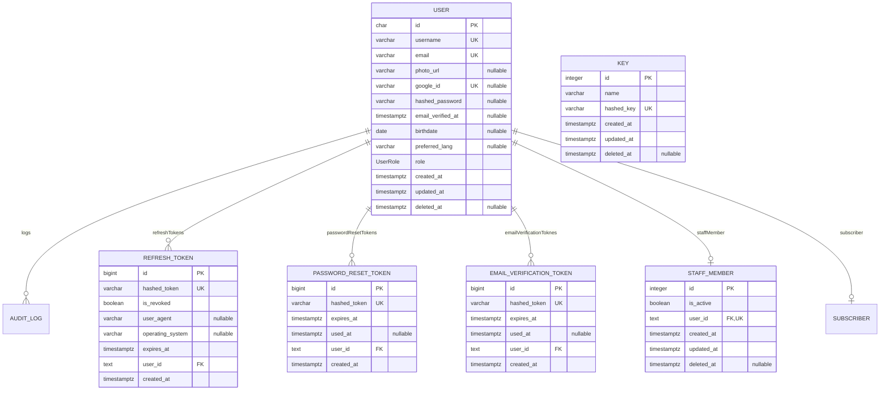
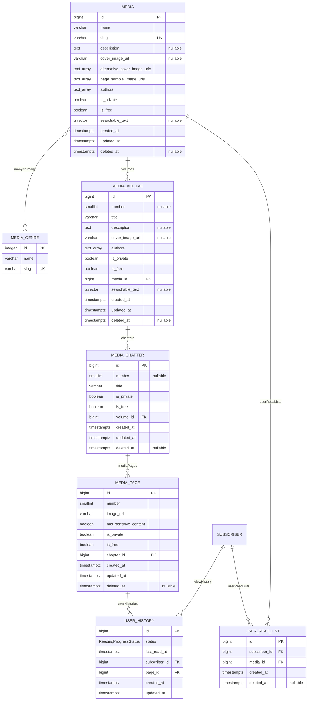
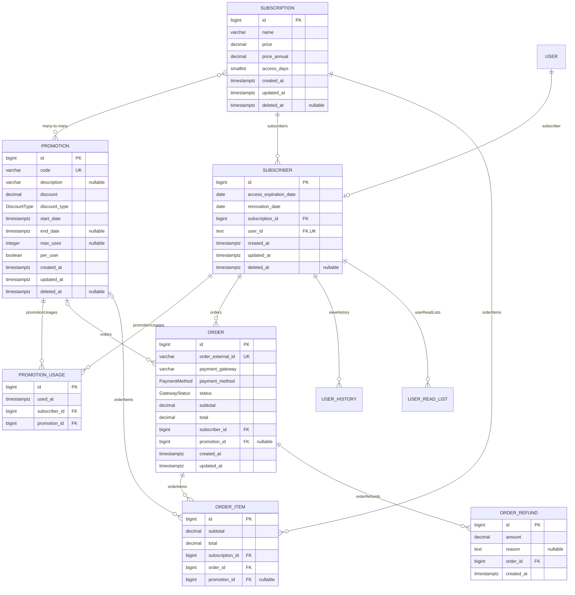
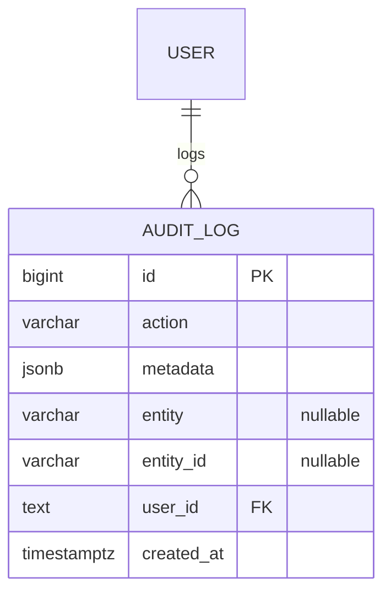

# Data Model Reference

**Location:** `prisma/models/*.prisma` — generated from the schema at commit `57dbfa6` of branch
`docs/restructure-documentation`, 2026-09-30.

The detailed entity-relationship model of `roobra-api`'s PostgreSQL database: every table with its
columns, keys and relationships, one diagram per schema file. The ecosystem-level view, with the
container that owns each entity and the decisions behind the model, is `roobra-docs`'s
[domain model](https://github.com/kelthon/roobra-docs/blob/main/architecture/data/domain-model.md).
How the schema files, ID types and client options are set up is in
[prisma-setup.md](./prisma-setup.md).

Only four tables are read or written by application code today: `users`, `refresh_tokens`,
`password_reset_tokens` and `email_verification_token`. Every other table is filled only by the
development seed (`prisma/seeds/`).

## How To Read The Diagrams

- Entity names are the model names in upper snake case; the table name is in the table under each
  diagram. Column names are the database names (`@map`), with the PostgreSQL type (`@db`, or
  Prisma's default type when there is none).
- `PK`, `FK` and `UK` mark primary, foreign and unique keys; `nullable` marks optional columns.
  Composite unique keys are listed under each diagram.
- Relationship labels are the Prisma relation field names. An entity from another schema file
  appears without columns.

## Auth & Identity

`auth.prisma`: Identity, sessions, one-time tokens, the staff profile and a `keys` table whose purpose is
not documented yet.

| Entity | Table |
| --- | --- |
| `USER` | `users` |
| `REFRESH_TOKEN` | `refresh_tokens` |
| `PASSWORD_RESET_TOKEN` | `password_reset_tokens` |
| `EMAIL_VERIFICATION_TOKEN` | `email_verification_token` |
| `KEY` | `keys` |
| `STAFF_MEMBER` | `staff_members` |

## Content & Discovery

`content.prisma`: The catalog hierarchy (media, volumes, chapters, pages), genres, and each subscriber's reading progress and read list.

| Entity | Table |
| --- | --- |
| `MEDIA` | `medias` |
| `MEDIA_VOLUME` | `media_volumes` |
| `MEDIA_CHAPTER` | `media_chapters` |
| `MEDIA_PAGE` | `media_pages` |
| `MEDIA_GENRE` | `media_genres` |
| `USER_HISTORY` | `user_histories` |
| `USER_READ_LIST` | `user_read_lists` |

Composite unique keys: `media_volumes`: (`media_id`, `number`); `media_chapters`: (`volume_id`, `number`); `media_pages`: (`chapter_id`, `number`); `user_read_lists`: (`subscriber_id`, `media_id`).

## Subscriptions & Payments

`commerce.prisma`: Plans, the subscriber profile, orders, refunds and promotions.

| Entity | Table |
| --- | --- |
| `SUBSCRIPTION` | `subscriptions` |
| `SUBSCRIBER` | `subscribers` |
| `PROMOTION` | `promotions` |
| `PROMOTION_USAGE` | `promotion_usages` |
| `ORDER` | `orders` |
| `ORDER_ITEM` | `order_items` |
| `ORDER_REFUND` | `order_refunds` |

Composite unique keys: `promotion_usages`: (`subscriber_id`, `promotion_id`).

## Audit & Security

`audit.prisma`: The audit log.

| Entity | Table |
| --- | --- |
| `AUDIT_LOG` | `audit_logs` |

## Enums

| Enum | Schema file | Values |
| --- | --- | --- |
| `UserRole` | `auth.prisma` | `SUBSCRIBER`, `ADMIN`, `CONTENT_MANAGER`, `SUPPORT_AGENT`, `STAFF` |
| `DiscountType` | `commerce.prisma` | `PERCENT`, `FIXED_VALUE` |
| `GatewayStatus` | `commerce.prisma` | `PENDING`, `WAITING`, `GENERATED`, `CANCELED`, `PAID`, `REFUND`, `PARTIAL_REFUND`, `WITH_ERROR`, `UNDERPAID`, `OVERPAID` |
| `PaymentMethod` | `commerce.prisma` | `BOLETO`, `CREDIT_CARD`, `DEBIT_CARD`, `PIX` |
| `ReadingProgressStatus` | `content.prisma` | `IN_PROGRESS`, `COMPLETED` |

`STAFF` in `UserRole` is deprecated and not a role; see
[the identity and roles ADR](https://github.com/kelthon/roobra-docs/blob/main/adr/2026-09-30-01-separate-identity-from-profiles-and-define-four-roles.md).

## Notes

- `medias` and `media_volumes` have a `searchable_text` `tsvector` column with a GIN index, and
  `users` has trigram GIN indexes on `username` and `email`.
- The `email_verification_token` table name is singular, unlike every other table, and the relation
  field on `User` is spelled `emailVerificationToknes`. Both are as in the schema.
- Foreign keys to `users.id` are `text` while `users.id` is `char(21)`: the foreign key columns
  have no `@db` attribute.
- These diagrams were generated once from the schema; until a generator is committed, a schema
  change updates them by hand in the same pull request.
